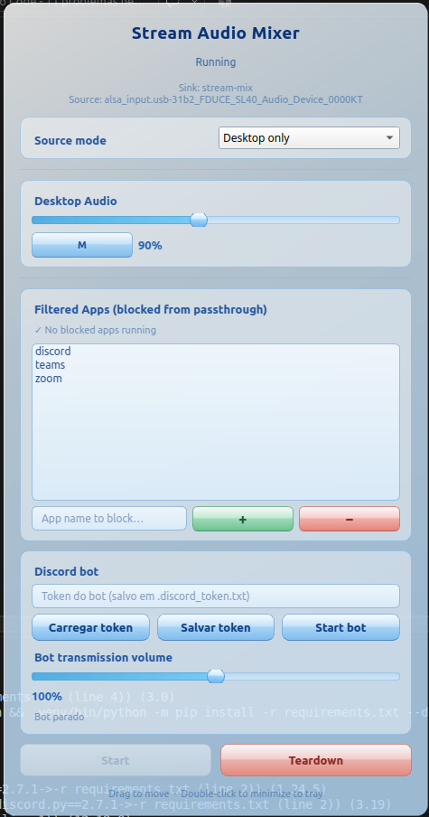

# AeroStream Mixer 🌊🎛️

Frutiger Aero styled PipeWire audio router for Linux. Routes desktop audio or microphone input to a virtual stream source, with an integrated Discord voice bot.

<p align="center">
  
</p>

---

## 🚀 Why Use This?

- **Linux audio capture:** Use `stream-mix.monitor` as an input device for Discord, OBS, a browser, or the integrated bot.
- **App Isolation:** Routes normal desktop applications through `stream-mix` and keeps Discord/Zoom/Teams on the physical sink, outside the captured monitor.
- **Loop-free playback:** The mix monitor is sent to the physical output for local listening. The physical output monitor is never fed back into the mix.
- **Live controls:** Adjust desktop source volume and bot transmission volume from the interface.
- **System Tray:** Minimize to tray with live routing status.

---

## 🛠️ Requirements & Test Conditions

> **Note:** Developed and tested specifically on **Linux Mint 22.2 (XFCE)** using **PipeWire 1.0.5** with ALSA (`k7.0.0-30-generic`, `snd_hda_intel` / `snd-usb-audio`).

Run the included installer:

```bash
./install-dependencies.sh
```

It installs the system packages, creates `.venv`, and installs the Python
packages from `requirements.txt`. The system also needs a running PipeWire or
PulseAudio session.

---

## 📦 Quick Start

```bash
git clone https://github.com/nickolasrm/AeroStream-Mixer.git
cd AeroStream-Mixer
./install-dependencies.sh
.venv/bin/python stream-audio-mixer.py
```

1. Select `Desktop only` or `Mic only` in the source mode.
2. Click **Start** to create the mixer route.
3. In Discord, OBS, or a browser, set the input device to:
   ```text
   Stream audio mix [stream-mix.monitor]
   ```
4. Use **Desktop Audio** to adjust the desktop source without changing the bot's final volume.
5. Click **Teardown** when done.

### Discord bot

1. Enter or load the token in the interface and click **Start bot**.
2. Join the desired voice channel.
3. Run `/play` in the Discord server.
4. Adjust **Bot transmission volume** for the Discord output only.
5. Run `/stop` to end transmission.

The bot joins the voice channel of the user who invoked `/play`. It captures
`stream-mix.monitor`, validates that the source exists, and reports FFmpeg
errors in `.discord_bot.log`.

---

## 📄 License

MIT
